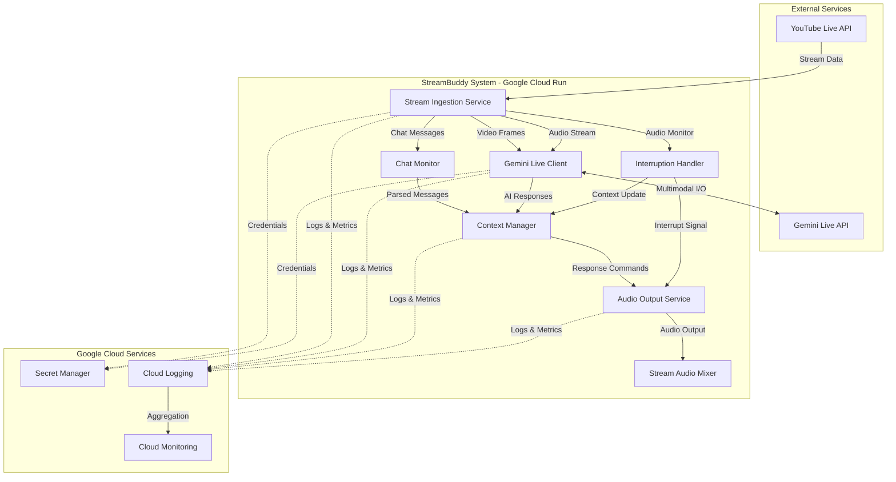
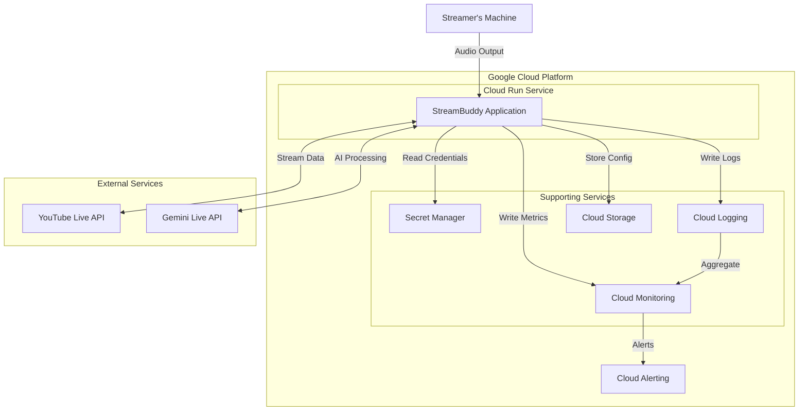
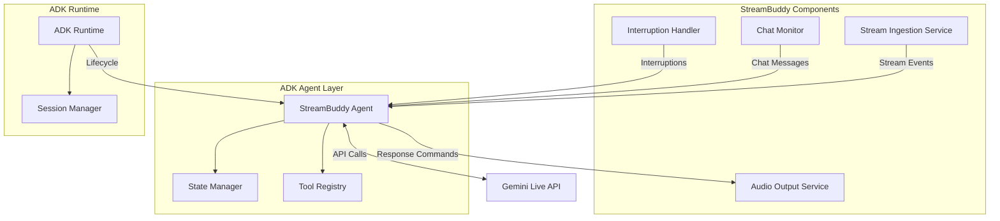

# StreamBuddy Design Document

## Overview

StreamBuddy is a real-time AI companion system for live streamers that provides natural, voice-based interaction during YouTube Live broadcasts. The system processes multimodal inputs (video, audio, and chat) in real-time and generates contextually relevant voice responses that enhance stream entertainment and viewer engagement.

### Core Capabilities

- Real-time multimodal stream processing (video, audio, chat)
- Natural voice response generation with sub-2-second latency
- Contextual commentary on gameplay and stream events
- Interactive chat message processing and responses
- Graceful interruption handling for natural conversation flow
- Customizable personality and behavior configuration

### Technology Stack

- **AI Processing**: Google Gemini Live API (multimodal understanding and voice generation)
- **Agent Framework**: Google Agent Development Kit (ADK)
- **Cloud Infrastructure**: Google Cloud Platform (Cloud Run, Cloud Logging, Cloud Monitoring, Secret Manager)
- **Stream Integration**: YouTube Live API (video, audio, and chat streams)
- **Programming Language**: Python 3.11+

### Key Design Principles

1. **Low Latency**: Optimize all data paths for sub-3-second end-to-end response times
2. **Resilience**: Graceful degradation and automatic recovery from transient failures
3. **Modularity**: Clear separation of concerns between ingestion, processing, and output
4. **Observability**: Comprehensive logging and metrics for monitoring and debugging
5. **Scalability**: Stateless design where possible to enable horizontal scaling


## Architecture

### System Architecture Diagram



### Architecture Overview

StreamBuddy follows a pipeline architecture with three main stages:

1. **Ingestion Stage**: Captures multimodal streams from YouTube Live
2. **Processing Stage**: Analyzes inputs and generates responses using Gemini Live API
3. **Output Stage**: Delivers voice responses to the stream audio mixer

The system is deployed as a single Cloud Run service with multiple internal components communicating via in-process message passing for minimal latency. This monolithic deployment approach is chosen for the hackathon context to minimize operational complexity while maintaining the ability to scale vertically.

### Data Flow

1. **Video/Audio Flow**: YouTube Live → Stream_Ingestion_Service → Gemini_Live_Client → Gemini Live API
2. **Chat Flow**: YouTube Live → Stream_Ingestion_Service → Chat_Monitor → Context_Manager → Gemini_Live_Client
3. **Response Flow**: Gemini Live API → Gemini_Live_Client → Context_Manager → Audio_Output_Service → Stream Mixer
4. **Interruption Flow**: Stream_Ingestion_Service → Interruption_Handler → Audio_Output_Service + Context_Manager


## Components and Interfaces

### Stream Ingestion Service

**Responsibility**: Capture and forward multimodal streams from YouTube Live API.

**Key Operations**:
- `connect_to_youtube(credentials: OAuth2Credentials) -> Connection`
- `start_video_capture(connection: Connection, frame_rate: int) -> VideoStream`
- `start_audio_capture(connection: Connection, buffer_ms: int) -> AudioStream`
- `start_chat_capture(connection: Connection) -> ChatStream`
- `handle_disconnection(connection: Connection) -> ReconnectionResult`

**Configuration**:
- Video frame rate: 1-5 fps (configurable, default 1 fps)
- Audio buffer size: 500ms maximum
- Reconnection attempts: 5 with exponential backoff (1s, 2s, 4s, 8s, 16s)

**Error Handling**:
- Connection failures trigger exponential backoff retry
- Stream disconnections logged and reconnection attempted
- Partial stream availability (e.g., chat only) supported

**Performance Targets**:
- Video frame forwarding: < 100ms per frame
- Audio forwarding: < 500ms buffering delay
- Chat message forwarding: < 200ms per message

### Gemini Live Client

**Responsibility**: Interface with Gemini Live API for multimodal processing and response generation.

**Key Operations**:
- `establish_session(api_key: str) -> Session`
- `send_video_frame(session: Session, frame: VideoFrame) -> None`
- `send_audio_chunk(session: Session, audio: AudioData) -> None`
- `send_text_message(session: Session, message: str) -> None`
- `receive_response(session: Session) -> AIResponse`
- `handle_rate_limit(session: Session) -> ThrottleAction`

**Configuration**:
- Persistent connection maintained throughout streaming session
- Request throttling when approaching rate limits
- Response timeout: 5 seconds

**API Integration Pattern**:
```python
# Pseudo-code for Gemini Live API integration
session = gemini_client.start_session(
    model="gemini-2.0-flash-exp",
    config={
        "response_modalities": ["AUDIO"],
        "speech_config": {
            "voice_config": {"prebuilt_voice_config": {"voice_name": "Puck"}}
        }
    }
)

# Send multimodal inputs
session.send(video_frame)
session.send(audio_chunk)
session.send(text_message)

# Receive streaming response
for response_chunk in session.receive():
    if response_chunk.audio_data:
        forward_to_audio_output(response_chunk.audio_data)
```

**Error Handling**:
- API errors trigger up to 3 retry attempts
- Rate limit detection with proactive throttling
- Session reconnection on connection loss

**Performance Targets**:
- Response forwarding: < 100ms after API response received
- API call duration: < 2 seconds for 95th percentile


### Context Manager

**Responsibility**: Maintain conversation state, analyze stream context, and orchestrate response generation.

**Key Operations**:
- `add_to_history(event: StreamEvent) -> None`
- `detect_significant_event(video_frames: List[VideoFrame], audio: AudioData) -> Optional[Event]`
- `generate_commentary_prompt(event: Event, history: ConversationHistory) -> str`
- `process_chat_message(message: ChatMessage, history: ConversationHistory) -> str`
- `handle_interruption(interrupted_response: str, new_input: str) -> str`
- `apply_personality_config(config: PersonalityConfig) -> None`

**State Management**:
- Conversation history: Last 50 interactions (sliding window)
- Recent events: Last 10 significant stream events
- Current response state: tracking active response generation
- Personality configuration: humor level, supportiveness, playfulness, verbosity

**Event Detection Logic**:
- Significant visual changes (scene transitions, dramatic moments)
- Emotional tone shifts in streamer audio
- Direct questions or mentions in chat
- Game-specific events (if game context available)

**Response Generation Strategy**:
```python
def generate_response(context: Context, trigger: Trigger) -> str:
    # Build prompt with personality and context
    prompt = f"""
    You are StreamBuddy, an AI co-host for a live stream.
    Personality: {context.personality}
    Recent events: {context.recent_events}
    Conversation history: {context.history}
    Current trigger: {trigger}
    
    Generate a natural, {context.personality.verbosity} response that:
    - Acknowledges the trigger
    - Relates to recent stream context
    - Matches the {context.personality.tone} tone
    """
    return prompt
```

**Performance Targets**:
- Event detection: < 1 second from input
- Prompt generation: < 100ms
- Context update: < 50ms

### Chat Monitor

**Responsibility**: Parse, filter, and prioritize incoming chat messages.

**Key Operations**:
- `parse_message(raw_message: str) -> ChatMessage`
- `extract_username_and_content(message: ChatMessage) -> Tuple[str, str]`
- `filter_spam(message: ChatMessage) -> bool`
- `prioritize_message(message: ChatMessage) -> Priority`
- `forward_to_context_manager(message: ChatMessage) -> None`

**Filtering Logic**:
- Spam detection: message rate > 5 per second from same user
- Content patterns: repeated characters, excessive caps, known spam phrases
- Minimum message length: 2 characters

**Prioritization Rules**:
1. High priority: Direct mentions of "StreamBuddy" or questions
2. Medium priority: Reactions to recent events
3. Low priority: General chat messages

**Performance Targets**:
- Message parsing: < 50ms per message
- Forwarding to Context Manager: < 200ms total


### Interruption Handler

**Responsibility**: Detect streamer interruptions and manage graceful response cancellation.

**Key Operations**:
- `monitor_audio_input(audio_stream: AudioStream) -> None`
- `detect_speech(audio_chunk: AudioData) -> bool`
- `signal_interruption(current_response_id: str) -> None`
- `notify_context_manager(interruption_context: InterruptionContext) -> None`

**Detection Algorithm**:
```python
def detect_interruption(audio_chunk: AudioData, response_active: bool) -> bool:
    if not response_active:
        return False
    
    # Use voice activity detection (VAD)
    speech_detected = vad_model.detect(audio_chunk)
    
    # Require sustained speech (300ms) to avoid false positives
    if speech_detected and duration > 300ms:
        return True
    
    return False
```

**Interruption Flow**:
1. Detect streamer speech during AI response
2. Signal Audio_Output_Service to stop playback (< 300ms)
3. Discard remaining response audio
4. Notify Context_Manager with interruption context
5. Context_Manager generates new response acknowledging interruption

**Performance Targets**:
- Speech detection latency: < 100ms
- Interruption signal delivery: < 300ms total
- Audio output stop: < 300ms from detection

### Audio Output Service

**Responsibility**: Deliver AI-generated voice responses to the stream audio mixer.

**Key Operations**:
- `initialize_audio_connection(mixer_config: MixerConfig) -> AudioConnection`
- `queue_response(audio_data: AudioData, priority: Priority) -> None`
- `play_audio(audio_data: AudioData) -> PlaybackResult`
- `stop_playback(response_id: str) -> None`
- `handle_playback_error(error: AudioError) -> RecoveryAction`

**Audio Pipeline**:
```
Gemini API Audio → Audio Buffer → Queue Manager → Audio Mixer → Stream Output
```

**Queue Management**:
- Sequential playback of queued responses
- Priority queue for urgent responses (e.g., interruption acknowledgments)
- Maximum queue size: 5 responses (drop oldest if exceeded)

**Audio Format**:
- Sample rate: 24kHz (Gemini Live API default)
- Encoding: PCM or Opus (depending on mixer requirements)
- Channels: Mono

**Error Handling**:
- Playback failures trigger audio connection reinitialization
- Failed responses logged with context
- Fallback to text-only mode if audio persistently fails

**Performance Targets**:
- End-to-end latency: < 2 seconds from input reception
- Queue processing: < 50ms per response
- Audio delivery: < 100ms to mixer


## Data Models

### Core Data Structures

#### VideoFrame
```python
@dataclass
class VideoFrame:
    timestamp: float  # Unix timestamp
    frame_data: bytes  # JPEG or PNG encoded
    width: int
    height: int
    sequence_number: int
```

#### AudioData
```python
@dataclass
class AudioData:
    timestamp: float
    audio_bytes: bytes
    sample_rate: int  # Hz
    duration_ms: int
    encoding: str  # "pcm", "opus", etc.
```

#### ChatMessage
```python
@dataclass
class ChatMessage:
    message_id: str
    username: str
    content: str
    timestamp: float
    priority: Priority  # HIGH, MEDIUM, LOW
    is_spam: bool
```

#### StreamEvent
```python
@dataclass
class StreamEvent:
    event_id: str
    event_type: str  # "visual_change", "emotional_shift", "chat_message", "game_event"
    timestamp: float
    description: str
    significance: float  # 0.0 to 1.0
    related_data: Dict[str, Any]
```

#### AIResponse
```python
@dataclass
class AIResponse:
    response_id: str
    audio_data: Optional[AudioData]
    text_content: str
    timestamp: float
    latency_ms: int
    triggered_by: str  # event_id or message_id
```

#### ConversationHistory
```python
@dataclass
class ConversationHistory:
    interactions: List[Interaction]  # Max 50, FIFO
    recent_events: List[StreamEvent]  # Max 10, FIFO
    session_start: float
    total_interactions: int
    
@dataclass
class Interaction:
    timestamp: float
    trigger: Union[ChatMessage, StreamEvent]
    response: AIResponse
```

#### PersonalityConfig
```python
@dataclass
class PersonalityConfig:
    humor_level: float  # 0.0 to 1.0
    supportiveness: float  # 0.0 to 1.0
    playfulness: float  # 0.0 to 1.0
    verbosity: str  # "concise", "moderate", "verbose"
    response_frequency: str  # "low", "medium", "high"
    chat_interaction_mode: str  # "selective", "responsive", "active"
```

### State Management

The Context_Manager maintains the following state:

- **Session State**: Active session ID, start time, configuration
- **Conversation History**: Sliding window of recent interactions
- **Event Buffer**: Recent significant stream events
- **Response State**: Currently active response, queue status
- **Connection State**: Status of all external connections

State is maintained in-memory for the duration of a streaming session. No persistent storage is used for stream data (privacy requirement).


## Correctness Properties

*A property is a characteristic or behavior that should hold true across all valid executions of a system-essentially, a formal statement about what the system should do. Properties serve as the bridge between human-readable specifications and machine-verifiable correctness guarantees.*

### Property 1: Multimodal Stream Reception

*For any* valid YouTube Live stream with video, audio, and chat enabled, the Stream_Ingestion_Service should successfully connect and receive data from all three modalities.

**Validates: Requirements 1.1, 1.2, 1.3**

### Property 2: Connection Retry with Exponential Backoff

*For any* connection failure to YouTube Live API, the Stream_Ingestion_Service should retry up to 5 times with exponentially increasing delays (1s, 2s, 4s, 8s, 16s).

**Validates: Requirements 1.4**

### Property 3: Disconnection Logging and Reconnection

*For any* stream disconnection event, the system should log the disconnection with timestamp and context, and immediately attempt reconnection.

**Validates: Requirements 1.5**

### Property 4: Video Frame Rate Constraint

*For any* active video stream, the Stream_Ingestion_Service should forward frames to Gemini_Live_Client at a rate of at least 1 frame per second.

**Validates: Requirements 1.6**

### Property 5: Audio Buffering Latency

*For any* audio chunk received from YouTube Live API, the Stream_Ingestion_Service should forward it to Gemini_Live_Client within 500ms.

**Validates: Requirements 1.7**

### Property 6: Multimodal Data Forwarding

*For any* video frame, audio chunk, or chat message received by Gemini_Live_Client, it should be forwarded to the Gemini Live API for processing.

**Validates: Requirements 2.2, 2.3, 2.4**

### Property 7: API Response Forwarding Latency

*For any* response received from Gemini Live API, the Gemini_Live_Client should forward it to Audio_Output_Service within 100ms.

**Validates: Requirements 2.5**

### Property 8: Persistent API Connection

*For any* streaming session, the Gemini_Live_Client should maintain an active connection to Gemini Live API from session start to session end without disconnection.

**Validates: Requirements 2.6, 10.4**

### Property 9: Rate Limit Throttling

*For any* sequence of API requests approaching rate limits, the Gemini_Live_Client should throttle subsequent requests to stay within quota limits.

**Validates: Requirements 2.7**

### Property 10: End-to-End Audio Response Latency

*For any* input trigger (chat message or stream event), the Audio_Output_Service should deliver the generated audio response within 2 seconds of input reception.

**Validates: Requirements 3.2**

### Property 11: Audio Routing to Mixer

*For any* generated audio response, the Audio_Output_Service should route it to the configured stream audio mixer.

**Validates: Requirements 3.3**

### Property 12: Sequential Response Queuing

*For any* set of multiple simultaneous response triggers, the Audio_Output_Service should queue all responses and deliver them sequentially without overlap.

**Validates: Requirements 3.4**

### Property 13: Chat Message Parsing

*For any* raw chat message from YouTube Live, the Chat_Monitor should successfully parse it into a structured ChatMessage with username and content fields populated.

**Validates: Requirements 4.1, 4.2**

### Property 14: Chat Message Forwarding Latency

*For any* parsed chat message, the Chat_Monitor should forward it to Context_Manager within 200ms.

**Validates: Requirements 4.3**

### Property 15: Spam Message Filtering

*For any* chat message matching spam patterns (high rate from same user, excessive caps, repeated characters), the Chat_Monitor should mark it as spam and filter it from processing.

**Validates: Requirements 4.4**

### Property 16: Priority Message Detection

*For any* chat message containing "StreamBuddy" or question patterns, the Chat_Monitor should assign it HIGH priority.

**Validates: Requirements 4.5**

### Property 17: Username Reference in Responses

*For any* chat message that triggers a response, the generated audio response should include a reference to the viewer's username.

**Validates: Requirements 4.6**

### Property 18: Significant Event Detection

*For any* video frame sequence showing significant visual changes or dramatic moments, the Context_Manager should detect and log the event within 1 second.

**Validates: Requirements 5.1**

### Property 19: Commentary Generation Latency

*For any* detected significant event, the Context_Manager should trigger commentary generation within 1 second of detection.

**Validates: Requirements 5.3**

### Property 20: Conversation History Maintenance

*For any* interaction during a streaming session, the Context_Manager should store it in conversation history and make it available for context in subsequent responses.

**Validates: Requirements 5.4**

### Property 21: Audio Monitoring During Response

*For any* active AI response playback, the Interruption_Handler should continuously monitor the audio input stream for streamer speech.

**Validates: Requirements 6.1**

### Property 22: Interruption Response Time

*For any* detected streamer speech during AI response playback, the Interruption_Handler should stop audio output within 300ms.

**Validates: Requirements 6.2**

### Property 23: Interruption Signal Propagation

*For any* detected interruption, the Interruption_Handler should signal the Context_Manager to process the interrupting input.

**Validates: Requirements 6.3**

### Property 24: Interrupted Response Discarding

*For any* interrupted AI response, the Interruption_Handler should discard the remaining unplayed audio and prevent it from being queued.

**Validates: Requirements 6.4**

### Property 25: Health Check Response Time

*For any* health check request to the system endpoint, the response should be returned within 1 second with current system status.

**Validates: Requirements 7.5**

### Property 26: Error and Event Logging

*For any* error or significant event in the system, a log entry should be written to Google Cloud Logging with timestamp, component, error code (if applicable), and context information.

**Validates: Requirements 7.6, 10.2, 10.5**

### Property 27: Chat Message End-to-End Latency

*For any* chat message received from YouTube Live, the system should generate and deliver an audio response within 3 seconds end-to-end.

**Validates: Requirements 9.1**

### Property 28: Multimodal Commentary End-to-End Latency

*For any* video and audio input triggering commentary, the system should generate and deliver an audio response within 4 seconds end-to-end.

**Validates: Requirements 9.2**

### Property 29: Latency Reliability

*For any* streaming session with multiple interactions, at least 95% of responses should meet their target latency thresholds (3s for chat, 4s for commentary).

**Validates: Requirements 9.3**

### Property 30: Performance Metric Logging

*For any* interaction exceeding target latency thresholds, the system should log performance metrics including actual latency, component breakdown, and trigger type.

**Validates: Requirements 9.4**

### Property 31: Concurrent Message Throughput

*For any* burst of up to 10 concurrent chat messages per second, the system should process all messages without latency degradation beyond normal thresholds.

**Validates: Requirements 9.5**

### Property 32: Metrics Emission

*For any* system operation, metrics for response latency, API call duration, and error rates should be emitted to the monitoring system.

**Validates: Requirements 10.1**

### Property 33: Health Check Endpoint Availability

*For any* time during system operation, the health check endpoint should be accessible and return system status including connection states and component health.

**Validates: Requirements 10.3**

### Property 34: Metrics Recording to Cloud Monitoring

*For any* emitted metric, it should be recorded to Google Cloud Monitoring for dashboard visualization and alerting.

**Validates: Requirements 10.6**

### Property 35: Configuration Parameter Acceptance

*For any* valid configuration update including personality traits (humor, supportiveness, playfulness), response frequency, verbosity, and chat interaction preferences, the system should accept and store the configuration.

**Validates: Requirements 11.1, 11.2, 11.3**

### Property 36: Configuration Update Application

*For any* configuration update, the new settings should be applied and affect subsequent responses within 10 seconds without requiring system restart.

**Validates: Requirements 11.5**

### Property 37: API Error Retry Logic

*For any* error returned by Gemini Live API, the Gemini_Live_Client should log the error and retry the request up to 3 times before failing.

**Validates: Requirements 12.1**

### Property 38: Persistent Reconnection Attempts

*For any* YouTube Live API connection failure, the Stream_Ingestion_Service should continue attempting reconnection indefinitely while logging each failure.

**Validates: Requirements 12.2**

### Property 39: Audio Output Error Recovery

*For any* audio output failure, the Audio_Output_Service should log the failure and attempt to reinitialize the audio connection.

**Validates: Requirements 12.3**

### Property 40: Graceful Degradation

*For any* non-critical component failure (e.g., chat monitoring), the system should continue operating with remaining functional components.

**Validates: Requirements 12.4**

### Property 41: Critical Failure Notification

*For any* critical component failure that cannot be recovered (e.g., Gemini API connection loss), the system should notify the streamer through available channels.

**Validates: Requirements 12.5**

### Property 42: Context Persistence During Temporary Failures

*For any* temporary connection failure lasting less than 30 seconds, the Context_Manager should maintain conversation history and state without loss.

**Validates: Requirements 12.6**

### Property 43: TLS Encrypted API Connections

*For any* connection to external APIs (YouTube Live, Gemini Live), the connection should use TLS encryption.

**Validates: Requirements 13.3**

### Property 44: Stream Data Non-Persistence

*For any* video or audio stream data received, it should not be persisted to disk or database beyond the current processing window (maximum 30 seconds).

**Validates: Requirements 13.4, 13.5**

### Property 45: Chat Input Sanitization

*For any* chat message received, the system should validate and sanitize the input to remove potentially malicious content before processing.

**Validates: Requirements 13.6**


## Error Handling

### Error Categories

#### Transient Errors
Errors that are temporary and likely to resolve with retry:
- Network timeouts
- API rate limiting
- Temporary service unavailability

**Handling Strategy**: Exponential backoff retry with maximum attempt limits

#### Permanent Errors
Errors that indicate configuration or authentication issues:
- Invalid API credentials
- Malformed requests
- Authorization failures

**Handling Strategy**: Log error, notify operator, halt affected component

#### Degraded State Errors
Errors that affect non-critical functionality:
- Chat monitoring failures
- Video frame processing errors
- Single message processing failures

**Handling Strategy**: Log error, continue operation with reduced functionality

### Component-Specific Error Handling

#### Stream Ingestion Service

```python
class StreamIngestionErrorHandler:
    def handle_connection_error(self, error: ConnectionError) -> Action:
        """Handle YouTube Live API connection failures"""
        log_error(error, context="youtube_connection")
        
        if self.retry_count < MAX_RETRIES:
            delay = calculate_exponential_backoff(self.retry_count)
            return Action.RETRY_AFTER(delay)
        else:
            notify_operator("YouTube connection failed after max retries")
            return Action.ENTER_DEGRADED_STATE
    
    def handle_stream_disconnection(self, stream_type: str) -> Action:
        """Handle mid-stream disconnections"""
        log_event(f"{stream_type} stream disconnected")
        return Action.ATTEMPT_RECONNECTION
    
    def handle_frame_processing_error(self, frame: VideoFrame, error: Exception) -> Action:
        """Handle individual frame processing failures"""
        log_error(error, context=f"frame_{frame.sequence_number}")
        return Action.SKIP_FRAME  # Continue with next frame
```

#### Gemini Live Client

```python
class GeminiClientErrorHandler:
    def handle_api_error(self, error: APIError) -> Action:
        """Handle Gemini Live API errors"""
        log_error(error, context="gemini_api")
        
        if error.is_rate_limit():
            return Action.THROTTLE_REQUESTS
        elif error.is_transient():
            if self.retry_count < 3:
                return Action.RETRY_IMMEDIATELY
            else:
                return Action.SKIP_REQUEST
        else:
            notify_operator(f"Gemini API error: {error.code}")
            return Action.ENTER_DEGRADED_STATE
    
    def handle_session_loss(self) -> Action:
        """Handle loss of persistent session"""
        log_error("Gemini session lost")
        return Action.REESTABLISH_SESSION
```

#### Audio Output Service

```python
class AudioOutputErrorHandler:
    def handle_playback_error(self, error: AudioError) -> Action:
        """Handle audio playback failures"""
        log_error(error, context="audio_playback")
        
        if error.is_device_error():
            return Action.REINITIALIZE_AUDIO_CONNECTION
        elif error.is_format_error():
            return Action.SKIP_RESPONSE  # Discard malformed audio
        else:
            return Action.RETRY_PLAYBACK
    
    def handle_mixer_connection_loss(self) -> Action:
        """Handle loss of connection to stream mixer"""
        log_error("Stream mixer connection lost")
        notify_operator("Audio output unavailable")
        return Action.ATTEMPT_RECONNECTION
```

### Error Recovery Patterns

#### Circuit Breaker Pattern
Used for external API calls to prevent cascading failures:

```python
class CircuitBreaker:
    def __init__(self, failure_threshold: int = 5, timeout: int = 60):
        self.failure_count = 0
        self.failure_threshold = failure_threshold
        self.timeout = timeout
        self.state = "CLOSED"  # CLOSED, OPEN, HALF_OPEN
        self.last_failure_time = None
    
    def call(self, func, *args, **kwargs):
        if self.state == "OPEN":
            if time.time() - self.last_failure_time > self.timeout:
                self.state = "HALF_OPEN"
            else:
                raise CircuitBreakerOpen("Service unavailable")
        
        try:
            result = func(*args, **kwargs)
            if self.state == "HALF_OPEN":
                self.state = "CLOSED"
                self.failure_count = 0
            return result
        except Exception as e:
            self.failure_count += 1
            self.last_failure_time = time.time()
            
            if self.failure_count >= self.failure_threshold:
                self.state = "OPEN"
                log_error("Circuit breaker opened", context=func.__name__)
            
            raise e
```

#### Graceful Degradation Strategy

When components fail, the system continues operating with reduced functionality:

| Failed Component | Degraded Functionality | Continued Functionality |
|-----------------|------------------------|-------------------------|
| Chat Monitor | No chat responses | Video/audio commentary continues |
| Video Stream | No visual commentary | Audio and chat responses continue |
| Audio Output | Silent mode (logs only) | Processing continues, responses logged |
| Context Manager | Stateless responses | Responses generated without history |

### Logging and Observability

All errors are logged with structured data:

```python
@dataclass
class ErrorLog:
    timestamp: float
    component: str
    error_type: str
    error_code: Optional[str]
    message: str
    stack_trace: Optional[str]
    context: Dict[str, Any]
    severity: str  # "INFO", "WARNING", "ERROR", "CRITICAL"
```

Critical errors trigger alerts through Google Cloud Monitoring with configurable thresholds.


## Testing Strategy

### Dual Testing Approach

StreamBuddy employs both unit testing and property-based testing to ensure comprehensive coverage:

- **Unit Tests**: Verify specific examples, edge cases, integration points, and error conditions
- **Property Tests**: Verify universal properties across randomized inputs to catch edge cases

This dual approach ensures both concrete behavior validation and general correctness across the input space.

### Property-Based Testing

**Framework**: Hypothesis (Python)

**Configuration**: Each property test runs a minimum of 100 iterations with randomized inputs to ensure robust coverage.

**Test Tagging**: Each property test includes a comment tag referencing the design document property:
```python
# Feature: stream-buddy, Property 1: Multimodal Stream Reception
@given(youtube_stream=valid_youtube_streams())
def test_multimodal_stream_reception(youtube_stream):
    ...
```

**Property Test Examples**:

```python
from hypothesis import given, strategies as st
import hypothesis

# Property 4: Video Frame Rate Constraint
# Feature: stream-buddy, Property 4: Video Frame Rate Constraint
@given(
    stream_duration=st.integers(min_value=5, max_value=60),
    frame_data=st.lists(st.binary(min_size=1024, max_size=10240))
)
@hypothesis.settings(max_examples=100)
def test_video_frame_rate_constraint(stream_duration, frame_data):
    """For any active video stream, frames should be forwarded at >= 1 fps"""
    ingestion_service = StreamIngestionService()
    gemini_client = MockGeminiClient()
    
    # Simulate stream
    start_time = time.time()
    ingestion_service.start_video_capture(frame_data)
    
    # Run for specified duration
    time.sleep(stream_duration)
    
    # Verify frame rate
    frames_forwarded = gemini_client.get_frame_count()
    expected_minimum = stream_duration * 1  # 1 fps minimum
    
    assert frames_forwarded >= expected_minimum, \
        f"Expected >= {expected_minimum} frames, got {frames_forwarded}"

# Property 12: Sequential Response Queuing
# Feature: stream-buddy, Property 12: Sequential Response Queuing
@given(
    num_triggers=st.integers(min_value=2, max_value=10),
    response_durations=st.lists(
        st.floats(min_value=0.5, max_value=3.0),
        min_size=2,
        max_size=10
    )
)
@hypothesis.settings(max_examples=100)
def test_sequential_response_queuing(num_triggers, response_durations):
    """For any multiple simultaneous triggers, responses should be delivered sequentially"""
    audio_service = AudioOutputService()
    playback_log = []
    
    # Trigger multiple responses simultaneously
    responses = [
        generate_mock_response(duration=response_durations[i])
        for i in range(num_triggers)
    ]
    
    for response in responses:
        audio_service.queue_response(response)
    
    # Monitor playback
    while audio_service.has_queued_responses():
        if audio_service.is_playing():
            playback_log.append(audio_service.current_response_id)
        time.sleep(0.1)
    
    # Verify no overlapping playback
    assert len(playback_log) == len(set(playback_log)), \
        "Responses overlapped during playback"
    
    # Verify all responses played
    assert len(set(playback_log)) == num_triggers, \
        f"Expected {num_triggers} responses, played {len(set(playback_log))}"

# Property 15: Spam Message Filtering
# Feature: stream-buddy, Property 15: Spam Message Filtering
@given(
    message_content=st.one_of(
        st.text(alphabet=st.characters(whitelist_categories=('Lu',)), min_size=10),  # All caps
        st.text(alphabet='a', min_size=20),  # Repeated characters
        st.just("BUY NOW!!! CLICK HERE!!!")  # Spam patterns
    ),
    username=st.text(min_size=3, max_size=20)
)
@hypothesis.settings(max_examples=100)
def test_spam_message_filtering(message_content, username):
    """For any message matching spam patterns, it should be filtered"""
    chat_monitor = ChatMonitor()
    
    message = ChatMessage(
        message_id=generate_id(),
        username=username,
        content=message_content,
        timestamp=time.time()
    )
    
    result = chat_monitor.process_message(message)
    
    # Spam messages should be marked and not forwarded
    assert result.is_spam == True, \
        f"Spam message not detected: {message_content}"
    assert result.forwarded == False, \
        "Spam message was forwarded to Context_Manager"
```

### Unit Testing

**Framework**: pytest

**Coverage Target**: 80% code coverage minimum

**Unit Test Focus Areas**:

1. **Component Initialization**
   - Verify components initialize with correct default configuration
   - Test configuration parameter validation
   - Test credential loading from Secret Manager

2. **Integration Points**
   - YouTube Live API connection establishment
   - Gemini Live API session creation
   - Audio mixer connection setup

3. **Edge Cases**
   - Empty chat messages
   - Malformed video frames
   - Audio buffer underruns
   - Extremely long chat messages (> 1000 characters)

4. **Error Conditions**
   - API authentication failures
   - Network timeouts
   - Invalid configuration values
   - Resource exhaustion scenarios

**Unit Test Examples**:

```python
import pytest
from unittest.mock import Mock, patch

def test_stream_ingestion_initialization():
    """Test Stream Ingestion Service initializes correctly"""
    config = StreamConfig(
        frame_rate=1,
        audio_buffer_ms=500,
        max_retries=5
    )
    
    service = StreamIngestionService(config)
    
    assert service.frame_rate == 1
    assert service.audio_buffer_ms == 500
    assert service.max_retries == 5
    assert service.connection_state == "DISCONNECTED"

def test_empty_chat_message_handling():
    """Test that empty chat messages are rejected"""
    chat_monitor = ChatMonitor()
    
    empty_message = ChatMessage(
        message_id="test_1",
        username="user1",
        content="",
        timestamp=time.time()
    )
    
    result = chat_monitor.process_message(empty_message)
    
    assert result.forwarded == False
    assert result.rejection_reason == "empty_content"

def test_api_authentication_failure():
    """Test handling of YouTube API authentication failure"""
    with patch('youtube_client.authenticate') as mock_auth:
        mock_auth.side_effect = AuthenticationError("Invalid credentials")
        
        service = StreamIngestionService()
        
        with pytest.raises(AuthenticationError):
            service.connect_to_youtube(invalid_credentials)
        
        # Verify error was logged
        assert "Invalid credentials" in service.get_error_log()

@pytest.mark.integration
def test_gemini_api_session_creation():
    """Integration test for Gemini Live API session"""
    client = GeminiLiveClient()
    
    session = client.establish_session(api_key=TEST_API_KEY)
    
    assert session is not None
    assert session.is_active()
    assert session.model == "gemini-2.0-flash-exp"
    
    session.close()
```

### Performance Testing

**Load Testing**: Simulate high chat message rates (10+ messages/second) to verify throughput requirements.

**Latency Testing**: Measure end-to-end latency for all interaction types:
- Chat message → audio response
- Video event → commentary
- Interruption → response stop

**Stress Testing**: Test system behavior under resource constraints:
- Limited network bandwidth
- High CPU usage
- Memory pressure

**Performance Test Example**:

```python
import time
import statistics

def test_chat_message_latency_distribution():
    """Verify 95% of chat responses meet 3-second latency target"""
    system = StreamBuddySystem()
    latencies = []
    
    # Generate 100 test messages
    for i in range(100):
        message = generate_test_chat_message()
        
        start_time = time.time()
        system.process_chat_message(message)
        
        # Wait for audio response
        response = system.wait_for_response(timeout=5)
        end_time = time.time()
        
        latency = end_time - start_time
        latencies.append(latency)
    
    # Calculate 95th percentile
    p95_latency = statistics.quantiles(latencies, n=20)[18]  # 95th percentile
    
    assert p95_latency < 3.0, \
        f"95th percentile latency {p95_latency}s exceeds 3s target"
    
    # Verify at least 95% meet target
    within_target = sum(1 for l in latencies if l < 3.0)
    percentage = (within_target / len(latencies)) * 100
    
    assert percentage >= 95, \
        f"Only {percentage}% of responses met latency target"
```

### Integration Testing

**End-to-End Tests**: Verify complete workflows from stream input to audio output.

**External Service Mocking**: Use mocks for YouTube Live API and Gemini Live API during CI/CD to avoid external dependencies.

**Test Environment**: Dedicated GCP project for testing with isolated resources.

### Continuous Integration

**CI Pipeline**:
1. Run unit tests (fast feedback)
2. Run property-based tests (comprehensive coverage)
3. Run integration tests (with mocked external services)
4. Generate coverage report
5. Run static analysis (mypy, pylint)
6. Build Docker container
7. Deploy to test environment
8. Run smoke tests

**Test Execution Time Targets**:
- Unit tests: < 2 minutes
- Property tests: < 10 minutes
- Integration tests: < 5 minutes
- Total CI pipeline: < 20 minutes


## Google Cloud Platform Deployment

### Deployment Architecture



### Cloud Run Configuration

**Service Specification**:
```yaml
apiVersion: serving.knative.dev/v1
kind: Service
metadata:
  name: streambuddy
  namespace: default
spec:
  template:
    metadata:
      annotations:
        autoscaling.knative.dev/minScale: "1"
        autoscaling.knative.dev/maxScale: "10"
        run.googleapis.com/cpu-throttling: "false"  # Always-on CPU for real-time processing
    spec:
      containerConcurrency: 1  # One streaming session per container
      timeoutSeconds: 3600  # 1 hour timeout for long streams
      containers:
      - image: gcr.io/PROJECT_ID/streambuddy:latest
        resources:
          limits:
            cpu: "2000m"
            memory: "4Gi"
          requests:
            cpu: "1000m"
            memory: "2Gi"
        env:
        - name: YOUTUBE_API_CREDENTIALS
          valueFrom:
            secretKeyRef:
              name: youtube-credentials
              key: oauth-token
        - name: GEMINI_API_KEY
          valueFrom:
            secretKeyRef:
              name: gemini-credentials
              key: api-key
        - name: GCP_PROJECT_ID
          value: "PROJECT_ID"
        - name: LOG_LEVEL
          value: "INFO"
        ports:
        - containerPort: 8080
          protocol: TCP
        livenessProbe:
          httpGet:
            path: /health
            port: 8080
          initialDelaySeconds: 10
          periodSeconds: 30
        readinessProbe:
          httpGet:
            path: /ready
            port: 8080
          initialDelaySeconds: 5
          periodSeconds: 10
```

**Rationale for Cloud Run**:
- Automatic scaling based on concurrent requests
- Pay-per-use pricing (ideal for hackathon/demo)
- Built-in HTTPS endpoints
- Integrated with Cloud Logging and Monitoring
- Supports long-running connections (WebSocket for Gemini Live API)
- No infrastructure management required

### Resource Sizing

**CPU**: 2 vCPU
- Video frame processing: ~0.5 vCPU
- Audio processing: ~0.3 vCPU
- Gemini API communication: ~0.2 vCPU
- Context management: ~0.3 vCPU
- Overhead: ~0.7 vCPU

**Memory**: 4 GB
- Video frame buffers: ~500 MB
- Audio buffers: ~200 MB
- Conversation history: ~100 MB
- Application code: ~300 MB
- Overhead: ~2.9 GB

**Network**: 10 Mbps minimum
- Video stream ingestion: ~3 Mbps
- Audio stream ingestion: ~128 Kbps
- Chat stream: ~10 Kbps
- Gemini API communication: ~2 Mbps
- Audio output: ~128 Kbps

### Secret Management

All sensitive credentials stored in Google Cloud Secret Manager:

```python
from google.cloud import secretmanager

def get_secret(secret_id: str) -> str:
    """Retrieve secret from Secret Manager"""
    client = secretmanager.SecretManagerServiceClient()
    project_id = os.environ['GCP_PROJECT_ID']
    
    name = f"projects/{project_id}/secrets/{secret_id}/versions/latest"
    response = client.access_secret_version(request={"name": name})
    
    return response.payload.data.decode('UTF-8')

# Usage
youtube_credentials = get_secret("youtube-oauth-token")
gemini_api_key = get_secret("gemini-api-key")
```

**Secrets to Store**:
- `youtube-oauth-token`: OAuth 2.0 token for YouTube Live API
- `gemini-api-key`: API key for Gemini Live API
- `stream-mixer-config`: Configuration for audio mixer connection

### Logging Configuration

**Structured Logging Format**:
```python
import logging
from google.cloud import logging as cloud_logging

# Initialize Cloud Logging
logging_client = cloud_logging.Client()
logging_client.setup_logging()

# Create structured logger
logger = logging.getLogger('streambuddy')

# Log with structured data
logger.info(
    "Chat message processed",
    extra={
        "component": "chat_monitor",
        "message_id": message.id,
        "username": message.username,
        "latency_ms": latency,
        "priority": message.priority
    }
)
```

**Log Levels**:
- **DEBUG**: Detailed diagnostic information (disabled in production)
- **INFO**: General informational messages (stream events, responses generated)
- **WARNING**: Unexpected but handled situations (retries, degraded performance)
- **ERROR**: Error conditions that affect functionality (API failures, connection losses)
- **CRITICAL**: Critical failures requiring immediate attention (system shutdown, data loss)

### Monitoring and Alerting

**Key Metrics**:
```python
from google.cloud import monitoring_v3

def record_metric(metric_name: str, value: float, labels: dict):
    """Record custom metric to Cloud Monitoring"""
    client = monitoring_v3.MetricServiceClient()
    project_name = f"projects/{os.environ['GCP_PROJECT_ID']}"
    
    series = monitoring_v3.TimeSeries()
    series.metric.type = f"custom.googleapis.com/streambuddy/{metric_name}"
    series.metric.labels.update(labels)
    
    point = monitoring_v3.Point()
    point.value.double_value = value
    point.interval.end_time.seconds = int(time.time())
    
    series.points = [point]
    client.create_time_series(name=project_name, time_series=[series])

# Record metrics
record_metric("response_latency", latency_ms, {"type": "chat"})
record_metric("api_call_duration", duration_ms, {"api": "gemini"})
record_metric("error_rate", error_count, {"component": "ingestion"})
```

**Alerting Policies**:
1. **High Latency Alert**: Trigger when 95th percentile latency > 5 seconds for 5 minutes
2. **Error Rate Alert**: Trigger when error rate > 10% for 2 minutes
3. **Connection Failure Alert**: Trigger when external API connections fail
4. **Resource Exhaustion Alert**: Trigger when CPU > 90% or Memory > 90% for 5 minutes

### Health Check Endpoints

```python
from fastapi import FastAPI, Response

app = FastAPI()

@app.get("/health")
def health_check():
    """Liveness probe - is the service running?"""
    return {"status": "healthy", "timestamp": time.time()}

@app.get("/ready")
def readiness_check():
    """Readiness probe - is the service ready to handle requests?"""
    checks = {
        "youtube_connection": check_youtube_connection(),
        "gemini_connection": check_gemini_connection(),
        "audio_output": check_audio_output(),
    }
    
    all_ready = all(checks.values())
    status_code = 200 if all_ready else 503
    
    return Response(
        content=json.dumps({
            "status": "ready" if all_ready else "not_ready",
            "checks": checks,
            "timestamp": time.time()
        }),
        status_code=status_code,
        media_type="application/json"
    )
```

### Deployment Process

**Build and Deploy Script**:
```bash
#!/bin/bash

# Set variables
PROJECT_ID="your-gcp-project-id"
REGION="us-central1"
SERVICE_NAME="streambuddy"

# Build container
docker build -t gcr.io/${PROJECT_ID}/${SERVICE_NAME}:latest .

# Push to Container Registry
docker push gcr.io/${PROJECT_ID}/${SERVICE_NAME}:latest

# Deploy to Cloud Run
gcloud run deploy ${SERVICE_NAME} \
  --image gcr.io/${PROJECT_ID}/${SERVICE_NAME}:latest \
  --platform managed \
  --region ${REGION} \
  --min-instances 1 \
  --max-instances 10 \
  --cpu 2 \
  --memory 4Gi \
  --timeout 3600 \
  --concurrency 1 \
  --no-cpu-throttling \
  --set-secrets YOUTUBE_API_CREDENTIALS=youtube-credentials:latest,GEMINI_API_KEY=gemini-credentials:latest \
  --allow-unauthenticated

# Get service URL
SERVICE_URL=$(gcloud run services describe ${SERVICE_NAME} --region ${REGION} --format 'value(status.url)')
echo "Service deployed at: ${SERVICE_URL}"
```

### Cost Estimation

**Cloud Run Costs** (per streaming hour):
- CPU: 2 vCPU × $0.00002400/vCPU-second × 3600 seconds = $0.17
- Memory: 4 GB × $0.00000250/GB-second × 3600 seconds = $0.04
- Requests: Minimal (long-lived connection)
- **Total per hour**: ~$0.21

**Additional GCP Services** (per month):
- Cloud Logging: ~$0.50/GB (estimated 10 GB/month) = $5.00
- Cloud Monitoring: ~$0.25/MB (estimated 100 MB/month) = $25.00
- Secret Manager: $0.06/secret/month × 3 secrets = $0.18
- **Total per month**: ~$30.18

**External API Costs**:
- YouTube Live API: Free (within quota limits)
- Gemini Live API: Variable based on usage (check current pricing)


## ADK Integration

### Agent Development Kit Overview

Google's Agent Development Kit (ADK) provides a framework for building AI agents with structured state management, tool integration, and lifecycle management. StreamBuddy leverages ADK to implement the Context_Manager and orchestrate interactions with Gemini Live API.

### ADK Architecture Integration



### Agent Implementation

**StreamBuddy Agent Definition**:

```python
from google.genai import Agent, types
from google.genai.adk import state, tools

class StreamBuddyAgent(Agent):
    """ADK-based agent for StreamBuddy live streaming companion"""
    
    def __init__(self, config: PersonalityConfig):
        super().__init__(
            model="gemini-2.0-flash-exp",
            system_instruction=self._build_system_instruction(config),
            tools=[
                self.analyze_video_event,
                self.process_chat_message,
                self.generate_commentary,
                self.handle_interruption
            ]
        )
        self.config = config
        self.conversation_history = []
        self.recent_events = []
    
    def _build_system_instruction(self, config: PersonalityConfig) -> str:
        """Build system instruction based on personality configuration"""
        return f"""
        You are StreamBuddy, an AI co-host for live streaming.
        
        Personality Traits:
        - Humor Level: {config.humor_level}/1.0
        - Supportiveness: {config.supportiveness}/1.0
        - Playfulness: {config.playfulness}/1.0
        - Verbosity: {config.verbosity}
        
        Your role is to:
        1. Provide entertaining commentary on stream events
        2. Respond to viewer chat messages naturally
        3. Support the streamer with encouragement and reactions
        4. Maintain conversation context throughout the stream
        
        Response Guidelines:
        - Keep responses {config.verbosity} (under 30 seconds of speech)
        - Match the energy level of the stream
        - Reference recent events and conversation history
        - Be natural and conversational, not robotic
        """
    
    @tools.tool
    def analyze_video_event(self, video_frames: list[bytes], description: str) -> dict:
        """Analyze video frames to detect significant events"""
        # ADK tool for video analysis
        return {
            "event_type": "visual_change",
            "significance": 0.8,
            "description": description,
            "timestamp": time.time()
        }
    
    @tools.tool
    def process_chat_message(self, username: str, message: str, priority: str) -> dict:
        """Process incoming chat message and determine response"""
        # ADK tool for chat processing
        should_respond = (
            priority == "HIGH" or
            self.config.chat_interaction_mode == "active" or
            (self.config.chat_interaction_mode == "responsive" and priority == "MEDIUM")
        )
        
        return {
            "should_respond": should_respond,
            "username": username,
            "message": message,
            "timestamp": time.time()
        }
    
    @tools.tool
    def generate_commentary(self, trigger: dict, context: dict) -> str:
        """Generate contextual commentary based on trigger and history"""
        # ADK tool for commentary generation
        prompt = self._build_commentary_prompt(trigger, context)
        return prompt
    
    @tools.tool
    def handle_interruption(self, interrupted_response: str, new_input: str) -> str:
        """Handle interruption and generate acknowledgment"""
        # ADK tool for interruption handling
        return f"Oh, {new_input}? Let me address that..."
    
    def _build_commentary_prompt(self, trigger: dict, context: dict) -> str:
        """Build prompt for commentary generation"""
        recent_events_str = "\n".join([
            f"- {event['description']} ({event['timestamp']})"
            for event in self.recent_events[-5:]
        ])
        
        history_str = "\n".join([
            f"- {interaction['trigger']} -> {interaction['response'][:50]}..."
            for interaction in self.conversation_history[-10:]
        ])
        
        return f"""
        Current Trigger: {trigger}
        
        Recent Stream Events:
        {recent_events_str}
        
        Recent Conversation:
        {history_str}
        
        Generate a natural, {self.config.verbosity} response that:
        - Acknowledges the trigger
        - Relates to recent context
        - Matches your personality configuration
        """

### State Management with ADK

**Session State**:

```python
from google.genai.adk import state

class StreamBuddyState(state.State):
    """ADK state management for StreamBuddy"""
    
    session_id: str
    session_start: float
    personality_config: PersonalityConfig
    conversation_history: list[dict] = state.field(default_factory=list, max_size=50)
    recent_events: list[dict] = state.field(default_factory=list, max_size=10)
    active_response_id: Optional[str] = None
    connection_states: dict[str, str] = state.field(default_factory=dict)
    
    def add_interaction(self, trigger: dict, response: dict):
        """Add interaction to conversation history"""
        self.conversation_history.append({
            "timestamp": time.time(),
            "trigger": trigger,
            "response": response
        })
        
        # Maintain sliding window (ADK handles max_size automatically)
    
    def add_event(self, event: dict):
        """Add significant event to recent events"""
        self.recent_events.append(event)
    
    def update_connection_state(self, service: str, state: str):
        """Update connection state for external service"""
        self.connection_states[service] = state
    
    def get_context_for_response(self) -> dict:
        """Get current context for response generation"""
        return {
            "history": self.conversation_history,
            "recent_events": self.recent_events,
            "session_duration": time.time() - self.session_start,
            "personality": self.personality_config
        }
```

### ADK Runtime Integration

**Application Entry Point**:

```python
from google.genai.adk import Runtime
import asyncio

class StreamBuddyApplication:
    """Main application integrating ADK runtime with StreamBuddy components"""
    
    def __init__(self, config: PersonalityConfig):
        # Initialize ADK runtime
        self.runtime = Runtime()
        
        # Create agent
        self.agent = StreamBuddyAgent(config)
        
        # Initialize state
        self.state = StreamBuddyState(
            session_id=generate_session_id(),
            session_start=time.time(),
            personality_config=config
        )
        
        # Initialize components
        self.ingestion_service = StreamIngestionService()
        self.chat_monitor = ChatMonitor()
        self.interruption_handler = InterruptionHandler()
        self.audio_output = AudioOutputService()
        
        # Start Gemini Live session through ADK
        self.session = self.runtime.create_session(
            agent=self.agent,
            state=self.state
        )
    
    async def start_streaming_session(self):
        """Start the streaming session"""
        # Connect to YouTube Live
        await self.ingestion_service.connect_to_youtube()
        
        # Start processing loops
        await asyncio.gather(
            self.process_video_stream(),
            self.process_audio_stream(),
            self.process_chat_stream(),
            self.monitor_interruptions()
        )
    
    async def process_chat_stream(self):
        """Process incoming chat messages"""
        async for message in self.chat_monitor.message_stream():
            # Use ADK agent to process message
            result = await self.session.run_tool(
                "process_chat_message",
                username=message.username,
                message=message.content,
                priority=message.priority
            )
            
            if result["should_respond"]:
                # Generate response through Gemini Live API via ADK
                response = await self.session.generate_response(
                    prompt=self.agent.generate_commentary(
                        trigger={"type": "chat", "data": message},
                        context=self.state.get_context_for_response()
                    )
                )
                
                # Add to history
                self.state.add_interaction(
                    trigger={"type": "chat", "message": message},
                    response=response
                )
                
                # Send to audio output
                await self.audio_output.play_response(response)
    
    async def process_video_stream(self):
        """Process video frames for event detection"""
        async for frame in self.ingestion_service.video_stream():
            # Send frame to Gemini Live API through ADK session
            await self.session.send_video_frame(frame)
            
            # Check for significant events
            event = await self.session.run_tool(
                "analyze_video_event",
                video_frames=[frame],
                description="Frame analysis"
            )
            
            if event["significance"] > 0.7:
                self.state.add_event(event)
                
                # Generate commentary if appropriate
                if self._should_generate_commentary():
                    await self._generate_commentary(event)
    
    async def monitor_interruptions(self):
        """Monitor for streamer interruptions"""
        async for interruption in self.interruption_handler.interruption_stream():
            # Stop current audio output
            await self.audio_output.stop_current_response()
            
            # Use ADK agent to handle interruption
            acknowledgment = await self.session.run_tool(
                "handle_interruption",
                interrupted_response=self.state.active_response_id,
                new_input=interruption.content
            )
            
            # Generate new response
            response = await self.session.generate_response(acknowledgment)
            await self.audio_output.play_response(response)
```

### ADK Benefits for StreamBuddy

1. **Structured State Management**: ADK provides built-in state management with persistence and versioning
2. **Tool Integration**: Easy integration of custom tools for video analysis, chat processing, etc.
3. **Session Management**: Automatic handling of Gemini Live API sessions and connection lifecycle
4. **Error Handling**: Built-in retry logic and error recovery for API calls
5. **Observability**: Integrated logging and metrics for agent operations
6. **Scalability**: ADK runtime handles concurrent requests and resource management

### ADK Configuration

**Agent Configuration File** (`agent_config.yaml`):

```yaml
agent:
  name: streambuddy
  model: gemini-2.0-flash-exp
  
  response_config:
    modalities:
      - AUDIO
    speech_config:
      voice:
        name: Puck
      
  tools:
    - name: analyze_video_event
      description: Analyze video frames for significant events
    - name: process_chat_message
      description: Process and prioritize chat messages
    - name: generate_commentary
      description: Generate contextual commentary
    - name: handle_interruption
      description: Handle streamer interruptions gracefully
  
  state:
    persistence: memory  # In-memory for streaming session
    max_history_size: 50
    max_events_size: 10
  
  runtime:
    timeout: 3600  # 1 hour session timeout
    max_concurrent_requests: 10
```

This ADK integration provides a robust foundation for StreamBuddy's AI agent capabilities while maintaining clean separation between the agent logic and the streaming infrastructure components.


## Performance Optimization Strategies

### Latency Optimization

#### 1. Pipeline Parallelization

Process different modalities in parallel to reduce end-to-end latency:

```python
import asyncio

async def process_multimodal_input(video_frame, audio_chunk, chat_messages):
    """Process all modalities in parallel"""
    results = await asyncio.gather(
        process_video(video_frame),
        process_audio(audio_chunk),
        process_chat(chat_messages),
        return_exceptions=True
    )
    
    # Combine results
    return combine_multimodal_results(results)
```

**Expected Improvement**: 40-60% reduction in processing time compared to sequential processing.

#### 2. Frame Rate Adaptation

Dynamically adjust video frame rate based on stream activity:

```python
class AdaptiveFrameRateController:
    def __init__(self):
        self.base_rate = 1.0  # 1 fps
        self.high_activity_rate = 3.0  # 3 fps
        self.activity_threshold = 0.7
    
    def get_target_frame_rate(self, recent_events: list) -> float:
        """Adjust frame rate based on stream activity"""
        if not recent_events:
            return self.base_rate
        
        # Calculate activity level
        recent_significance = [e.significance for e in recent_events[-5:]]
        avg_significance = sum(recent_significance) / len(recent_significance)
        
        if avg_significance > self.activity_threshold:
            return self.high_activity_rate
        else:
            return self.base_rate
```

**Expected Improvement**: 30% reduction in API calls during low-activity periods, faster response during high-activity periods.

#### 3. Audio Streaming

Stream audio output as it's generated rather than waiting for complete response:

```python
async def stream_audio_response(session, prompt):
    """Stream audio output in real-time"""
    async for chunk in session.generate_streaming_response(prompt):
        if chunk.audio_data:
            # Play audio immediately without buffering entire response
            await audio_output.play_chunk(chunk.audio_data)
```

**Expected Improvement**: 50-70% reduction in perceived latency for long responses.

#### 4. Predictive Commentary

Pre-generate commentary for likely events to reduce response time:

```python
class PredictiveCommentaryCache:
    def __init__(self):
        self.cache = {}
        self.common_events = ["victory", "defeat", "close_call", "funny_moment"]
    
    async def warm_cache(self, context: dict):
        """Pre-generate commentary for likely events"""
        for event_type in self.common_events:
            if event_type not in self.cache:
                commentary = await generate_commentary(event_type, context)
                self.cache[event_type] = commentary
    
    def get_cached_commentary(self, event_type: str) -> Optional[str]:
        """Retrieve pre-generated commentary"""
        return self.cache.get(event_type)
```

**Expected Improvement**: Near-instant responses for common events (< 500ms).

### Throughput Optimization

#### 1. Message Batching

Batch multiple chat messages for efficient processing:

```python
class MessageBatcher:
    def __init__(self, batch_size: int = 5, max_wait_ms: int = 200):
        self.batch_size = batch_size
        self.max_wait_ms = max_wait_ms
        self.current_batch = []
        self.last_batch_time = time.time()
    
    async def add_message(self, message: ChatMessage):
        """Add message to batch"""
        self.current_batch.append(message)
        
        # Process batch if full or timeout reached
        if (len(self.current_batch) >= self.batch_size or
            (time.time() - self.last_batch_time) * 1000 > self.max_wait_ms):
            await self.process_batch()
    
    async def process_batch(self):
        """Process accumulated messages"""
        if not self.current_batch:
            return
        
        # Prioritize and select messages to respond to
        prioritized = sorted(self.current_batch, key=lambda m: m.priority, reverse=True)
        selected = prioritized[:3]  # Respond to top 3
        
        # Process selected messages
        for message in selected:
            await process_message(message)
        
        self.current_batch = []
        self.last_batch_time = time.time()
```

**Expected Improvement**: 3-5x increase in chat message throughput during high-activity periods.

#### 2. Connection Pooling

Maintain connection pools for external APIs:

```python
class APIConnectionPool:
    def __init__(self, max_connections: int = 5):
        self.pool = asyncio.Queue(maxsize=max_connections)
        self.max_connections = max_connections
        self._initialize_pool()
    
    def _initialize_pool(self):
        """Initialize connection pool"""
        for _ in range(self.max_connections):
            connection = create_api_connection()
            self.pool.put_nowait(connection)
    
    async def execute_request(self, request):
        """Execute request using pooled connection"""
        connection = await self.pool.get()
        try:
            result = await connection.execute(request)
            return result
        finally:
            await self.pool.put(connection)
```

**Expected Improvement**: 20-30% reduction in API call overhead.

### Resource Optimization

#### 1. Memory Management

Implement aggressive memory management for stream data:

```python
class StreamDataBuffer:
    def __init__(self, max_size_mb: int = 100):
        self.max_size_bytes = max_size_mb * 1024 * 1024
        self.current_size = 0
        self.buffer = collections.deque()
    
    def add_frame(self, frame: VideoFrame):
        """Add frame with automatic eviction"""
        frame_size = len(frame.frame_data)
        
        # Evict old frames if necessary
        while self.current_size + frame_size > self.max_size_bytes and self.buffer:
            old_frame = self.buffer.popleft()
            self.current_size -= len(old_frame.frame_data)
            del old_frame  # Explicit deletion
        
        self.buffer.append(frame)
        self.current_size += frame_size
    
    def get_recent_frames(self, count: int) -> list:
        """Get most recent frames"""
        return list(self.buffer)[-count:]
```

**Expected Improvement**: Stable memory usage regardless of stream duration.

#### 2. Compression

Compress video frames before sending to API:

```python
import cv2

def compress_frame(frame: VideoFrame, quality: int = 85) -> VideoFrame:
    """Compress video frame to reduce bandwidth"""
    # Decode frame
    img = cv2.imdecode(np.frombuffer(frame.frame_data, np.uint8), cv2.IMREAD_COLOR)
    
    # Resize if too large
    max_dimension = 1280
    height, width = img.shape[:2]
    if max(height, width) > max_dimension:
        scale = max_dimension / max(height, width)
        img = cv2.resize(img, None, fx=scale, fy=scale)
    
    # Compress with JPEG
    encode_param = [int(cv2.IMWRITE_JPEG_QUALITY), quality]
    _, compressed = cv2.imencode('.jpg', img, encode_param)
    
    return VideoFrame(
        timestamp=frame.timestamp,
        frame_data=compressed.tobytes(),
        width=img.shape[1],
        height=img.shape[0],
        sequence_number=frame.sequence_number
    )
```

**Expected Improvement**: 60-80% reduction in bandwidth usage for video frames.

### Network Optimization

#### 1. Request Prioritization

Prioritize critical requests over non-critical ones:

```python
class PriorityRequestQueue:
    def __init__(self):
        self.high_priority = asyncio.Queue()
        self.normal_priority = asyncio.Queue()
        self.low_priority = asyncio.Queue()
    
    async def add_request(self, request, priority: str):
        """Add request to appropriate queue"""
        if priority == "HIGH":
            await self.high_priority.put(request)
        elif priority == "NORMAL":
            await self.normal_priority.put(request)
        else:
            await self.low_priority.put(request)
    
    async def get_next_request(self):
        """Get next request with priority ordering"""
        # Check high priority first
        if not self.high_priority.empty():
            return await self.high_priority.get()
        
        # Then normal priority
        if not self.normal_priority.empty():
            return await self.normal_priority.get()
        
        # Finally low priority
        return await self.low_priority.get()
```

**Priority Levels**:
- **HIGH**: Interruption handling, direct chat responses
- **NORMAL**: Commentary generation, event processing
- **LOW**: Background analysis, metrics collection

#### 2. Adaptive Quality

Adjust processing quality based on network conditions:

```python
class AdaptiveQualityController:
    def __init__(self):
        self.current_quality = "high"
        self.latency_threshold_ms = 2000
    
    def adjust_quality(self, recent_latencies: list[float]):
        """Adjust quality based on performance"""
        avg_latency = sum(recent_latencies) / len(recent_latencies)
        
        if avg_latency > self.latency_threshold_ms:
            if self.current_quality == "high":
                self.current_quality = "medium"
                self._apply_medium_quality_settings()
            elif self.current_quality == "medium":
                self.current_quality = "low"
                self._apply_low_quality_settings()
        elif avg_latency < self.latency_threshold_ms * 0.7:
            if self.current_quality == "low":
                self.current_quality = "medium"
                self._apply_medium_quality_settings()
            elif self.current_quality == "medium":
                self.current_quality = "high"
                self._apply_high_quality_settings()
    
    def _apply_high_quality_settings(self):
        """High quality: 3 fps video, full audio, all chat"""
        self.video_fps = 3
        self.audio_quality = "high"
        self.chat_filter_threshold = 0.3
    
    def _apply_medium_quality_settings(self):
        """Medium quality: 1 fps video, compressed audio, filtered chat"""
        self.video_fps = 1
        self.audio_quality = "medium"
        self.chat_filter_threshold = 0.5
    
    def _apply_low_quality_settings(self):
        """Low quality: 0.5 fps video, compressed audio, priority chat only"""
        self.video_fps = 0.5
        self.audio_quality = "low"
        self.chat_filter_threshold = 0.8
```

**Expected Improvement**: Maintains functionality under poor network conditions.

### Monitoring and Profiling

#### Performance Metrics Dashboard

Track key performance indicators:

```python
class PerformanceMonitor:
    def __init__(self):
        self.metrics = {
            "video_processing_time": [],
            "audio_processing_time": [],
            "chat_processing_time": [],
            "api_call_duration": [],
            "end_to_end_latency": [],
            "memory_usage": [],
            "cpu_usage": []
        }
    
    def record_metric(self, metric_name: str, value: float):
        """Record performance metric"""
        self.metrics[metric_name].append(value)
        
        # Keep only recent values (last 1000)
        if len(self.metrics[metric_name]) > 1000:
            self.metrics[metric_name] = self.metrics[metric_name][-1000:]
    
    def get_statistics(self, metric_name: str) -> dict:
        """Get statistics for a metric"""
        values = self.metrics[metric_name]
        if not values:
            return {}
        
        return {
            "mean": statistics.mean(values),
            "median": statistics.median(values),
            "p95": statistics.quantiles(values, n=20)[18],
            "p99": statistics.quantiles(values, n=100)[98],
            "min": min(values),
            "max": max(values)
        }
    
    def export_dashboard_data(self) -> dict:
        """Export data for monitoring dashboard"""
        return {
            metric: self.get_statistics(metric)
            for metric in self.metrics.keys()
        }
```

### Performance Targets Summary

| Metric | Target | Optimization Strategy |
|--------|--------|----------------------|
| Chat Response Latency | < 3s | Streaming audio, batching, caching |
| Commentary Latency | < 4s | Parallel processing, adaptive frame rate |
| Video Processing | 1-3 fps | Adaptive rate, compression |
| Memory Usage | < 4 GB | Aggressive eviction, compression |
| CPU Usage | < 80% | Async I/O, efficient algorithms |
| API Call Overhead | < 200ms | Connection pooling, batching |
| Throughput | 10 msg/s | Batching, prioritization |

These optimization strategies ensure StreamBuddy meets real-time performance requirements while maintaining high-quality interactions throughout the streaming session.

